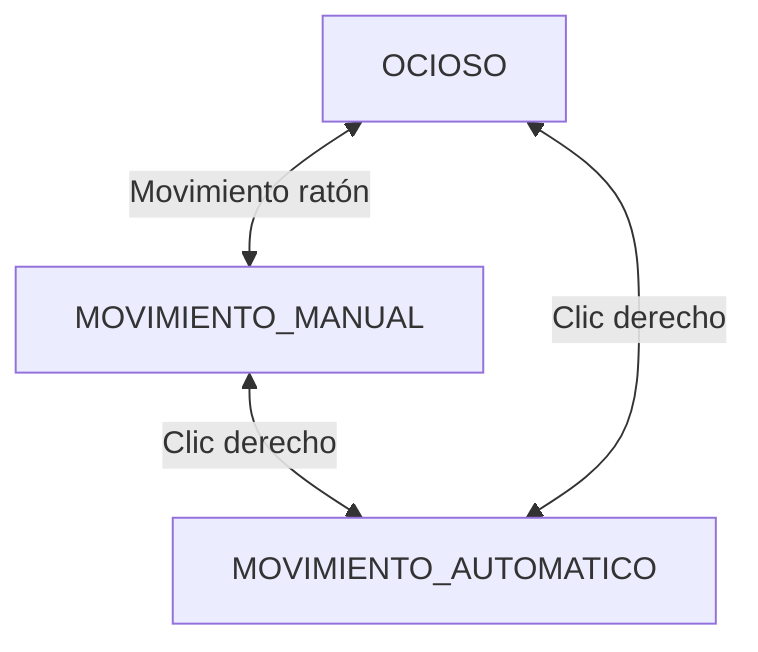
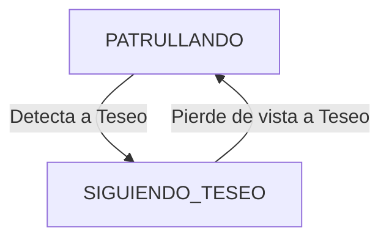
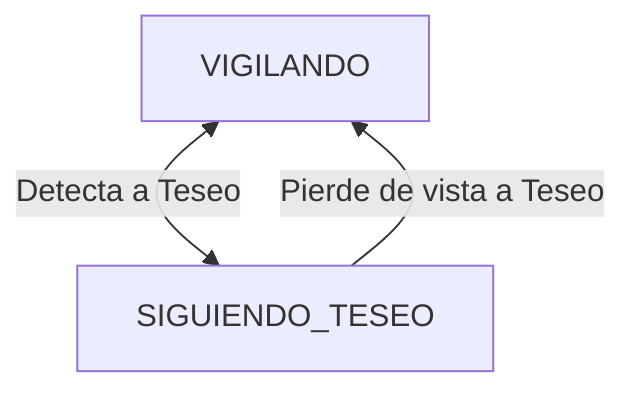
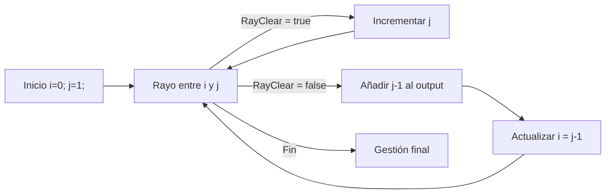

# Inteligencia Artificial para Videojuegos - Práctica 2: El secreto del laberinto

> [!NOTE]
> Versión: 1

## Índice
1. [Autores](#autores)
2. [Resumen](#resumen)
3. [Instalación y uso](#instalación-y-uso)
4. [Introducción](#introducción)
5. [Punto de partida](#punto-de-partida)
6. [Planteamiento del problema](#planteamiento-del-problema)
7. [Diseño de la solución](#diseño-de-la-solución)
8. [Implementación](#implementación)
9. [Pruebas y métricas](#pruebas-y-métricas)
10. [Ampliaciones](#ampliaciones)
11. [Conclusiones](#conclusiones)
12. [Licencia](#licencia)
13. [Referencias](#referencias)

## Autores
- Nieves Alonso Gilsanz [@nievesag](https://github.com/nievesag)
- Cynthia Tristán Álvarez [@cyntrist](https://github.com/cyntrist)

## Resumen
El proyecto consiste en un entorno virtual 3D que representa el legendario Laberinto del Minotauro, generado a partir de una descripción en forma de fichero de texto, con un personaje controlable por el jugador que es Teseo y uno o varios minotauros que actúan como enemigos.

## Instalación y uso
Todo el contenido del proyecto está disponible en este repositorio, con **Unity 6000.0.66f2** o posterior siendo capaces de bajar todos los paquetes necesarios y editar el proyecto.

## Introducción
Este proyecto es una práctica de la asignatura de Inteligencia Artificial para Videojuegos del Grado en Desarrollo de Videojuegos de la UCM, cuyo enunciado original es este: [El Secreto del Laberinto](https://narratech.com/es/inteligencia-artificial-para-videojuegos/navegacion/el-secreto-del-laberinto/).

El conocido mito griego del hilo de Ariadna sirve de trasfondo narrativo para el problema de la navegación de entornos virtuales, tan habitual en el mundo de los videojuegos. En la historia hay un protagonista, Teseo -en principio heroico- y un villano, el temido Minotauro. Ambos personajes se enfrentan en un laberinto embrujado donde el hilo mágico que Ariadna entregó a Teseo será la clave para ayudarle a escapar. Aunque en el mito se habla de la victoria de Teseo sobre el Minotauro, aquí vamos a aplicar la “maldición” que le lanza Ariadna de forma anticipada, para que sea imposible acabar con el monstruo. Mientras el héroe esté cerca del enemigo, habrá un combate que lo único que supone es ralentizar su movimiento. 

El proyecto está pensado para implementar el algoritmo de búsqueda A* con una estructura de registro de nodo simple: identificador del nodo y su coste f, y ligada a los propios GameObjects que son las baldosas del laberinto. Sólo se plantea usar una lista de apertura (sin tener lista de cierre) y se asume que es posible tener la información completa del grafo (costes incluidos) en forma de una matriz en memoria.

## Punto de partida
Hemos partido de un proyecto base proporcionado por el profesor y disponible en este repositorio: [Minotaur - Base](https://github.com/narratech/minotaur-base).

La base consiste en un menú inicial en el que se puede configurar:
- Tamaño del mapa (10x10, 20x20, 30x30, 60x60, 100x100)
- Nº de minotauros en el mapa

Y un botón con el que iniciar el juego, que lleva al nivel del laberinto, con suelos, paredes, minotauro/s, el avatar en la casilla de entrada, la casilla de entrada y la de salida, que cuenta con una interfaz básica meramente informativa con: 
- FPS
- Heuristica (Primera/Segunda)
- Controles:
    - Cambiar ratio de FPS entre 30 y 60 (F).
    - zoom (Rueda del ratón).
    - Reiniciar (R).
    - Cambiar heurística (C).
  
También cuenta con movimiento del avatar del jugador con WASD.

### Estructura del proyecto

Los recursos que conforman el proyecto están organizados de esta forma:

* **Animations**. La animación del personaje protagonista.
* **Materials**. Los materiales de uso general.
* **Models**. Los modelos de los personajes y elementos del escenario.
  * **Fonts**. Fuentes que se pueden utilizar (deberían estar fuera).
  * **Images**. Imágenes que se pueden utilizar (deberían estar fuera).
  * **Materials**. Más materiales relativos al escenario (deberían estar fuera, integrados con los otros).
* **Prefabs**. Los prefabricados que se usan en el juego, del avatar, los enemigos y las distintas partes del escenario. 
* **Resources**. Recursos extra que puedan hacer falta.
  * **Maps**. Los ficheros de texto que representan los mapas de distintos laberintos posibles a elegir.
* **Scenes**. La escena inicial del menú, con la selección de mapa, y la escena donde se carga el laberinto elegido.
* **Scripts**. Todas las clases con el código, incluido el GameManager y otras organizadas en una jerarquía de carpetas.
  * **Agent**. Las clases relativas al agente y su movimiento con comportamientos de dirección.
  * **Animation**. Las clases relativas al movimiento de la cámara y las animaciones.
  * **Comportamientos**. Las clases relativas al control de Teseo, el avatar protagonista, el movimiento de los minotauros, enemigos del juego, y todos los comportamientos de dirección necesarios.
  * **Extra**. Las clases adicionales para un tema del menú y la implementación de la cola de prioridad (en caso de que se quiera usar esta en lugar de la estándar de C#).
  * **Graphs**. Las clases necesarias para representar el espacio de búsqueda en forma de grafo, grafo basado en una rejilla y estructuras auxiliares como los nodos de dicho grafo. 

### Estructura de las escenas

Hay sólamente dos escenas en el juego.

### Menú
Se muestra el título del juego, una lista de mapas de laberintos disponibles para elegir, y dos campos para seleccionar el número de minotauros patrulla y el número de minotauros estáticos/vigías.

### Principal
La escena genera un laberinto en base al mapa que es haya elegido en el menú, generando el suelo y los muros casilla por casilla. Además, se guardan la casilla de entrada y la de salida. Otros game objects son el avatar del jugador y el minotaur manager, que instancia y controla los minotauros, con su correspondiente esfera de deceleración y comportamientos según su tipo.

## Planteamiento del problema

**El prototipo permitirá:**
* **A.** Hay un mundo virtual (el laberinto del Minotauro) con habitaciones y pasillos de tamaño y complejidad configurable, con un esquema de división de grafo de baldosas que incluye una baldosa de entrada, donde se ubica inicialmente el avatar (Teseo), y una baldosa de salida. Hay varios caminos alternativos para llegar a la salida, alguno ancho y alguno estrecho (pasillos de una única baldosa de anchura, donde es muy probable toparnos con el enemigo). El avatares controlado por el jugador mediante el ratón. Si el puntero está más allá de cierta distancia del avatar, este camina en línea recta hacia la posición del puntero. Mientras se mantiene pulsado el clic izquierdo, el avatar corre más rápido.

* **B.** En mitad del laberinto están los enemigos (uno o varios minotauros, de dos tipos y número también configurable). Unos son vigías que permanecen quietos en su sitio, rotando aleatoriamente. Otros son patrulleros que siempre están caminando en línea recta, pudiendo cambiar de dirección aleatoriamente al llegar a las encrucijadas del laberinto. Los dos tipos de minotauro tienen un cono de visión y si detectan al avatar del jugador se ponen a perseguirlo. También tienen un área de influencia, que se muestra visualmente, consistente en las baldosas vecinas (vecindad Manhattan de radio 3 sin que haya obstáculos por medio) que ralentizan a Teseo si intenta atravesarlas para «escenificar» que héroe y minotauro están en pleno combate.

* **C.** El camino más corto a la baldosa de salida (¡sin poder hacer navegación en diagonal, ojo!) calculado mediante A* (hilo de Ariadna) se representa pintado con una línea blanca y marcando cada baldosa que lo compone con una esfera blanca (ovillo) en el centro de la baldosa. Un nuevo hilo se crea cada vez que intentamos salir del laberinto (con el clic derecho del ratón se crea o se destruye, como un interruptor). Se tienen en cuenta todos los costes, incluidos los de las baldosas con minotauros (coste infinito) y las baldosas de sus zonas de influencia (coste 5), siendo 1 el coste de una baldosa normal. La conexión que permite llegar a una baldosa es la que tiene el coste de esa baldosa de destino. Desde una opción de la interfaz de usuario es posible elegir la heurística a utilizar en el algoritmo A*, habiendo al menos 2 diferentes.

* **D.** También se puede elegir si queremos suavizar o no el camino generado por el algoritmo anterior (activando o desactivando la funcionalidad desde otra opción de la interfaz de usuario). Esto reduce las baldosas que forman parte del camino original a la salida, y por tanto también reduce la cantidad de esferas blancas mostradas sobre ellas.

* **E.** El avatar navega y se mueve automáticamente (con comportamientos de dirección creados en el proyecto) hacia la baldosa de salida en cuanto creamos un nuevo hilo de Ariadna. Este movimiento va haciendo desaparecer la parte del hilo ya recorrida, para que sólo quede la parte del camino que falta por recorrer. Si destruimos el hilo, el avatar vuelve a su estado habitual, volviendo a ser controlado por el jugador. La implementación es eficiente y consigue maximizar las métricas (ej. escapar de un laberinto que tiene un gran número de casillas por el camino más corto, tardando el menor tiempo posible en calcular la ruta y explorando el menor número de nodos posibles durante esos cálculos).

## Diseño de la solución

### Estados de los agentes

- **Teseo**:


- **Minotauros Patrulla**:


- **Minotauros Vigía**:


Los scripts usados para cada agente de IA han sido:
* **Teseo**: 
    * ControlJugador 
    * SeguirCamino
* **Minotauro vigía**:
    * Llegada
    * CampoVision
    * Vigilar
* **Minotauro patrulla**: 
    * Llegada
    * CampoVision
    * Patrullar

Para calcular el camino más corto hasta la salida se ha implementado el algoritmo A* cuyo pseudocódigo se adjunta a continuación:
### A* 
```
function reconstruct_path(cameFrom, current)
    total_path := {current}
    while current in cameFrom.Keys:
        current := cameFrom[current]
        total_path.prepend(current)
    return total_path

// A* finds a path from start to goal.
// h is the heuristic function. h(n) estimates the cost to reach goal from node n.
function A_Star(start, goal, h)
    // The set of discovered nodes that may need to be (re-)expanded.
    // Initially, only the start node is known.
    // This is usually implemented as a min-heap or priority queue rather than a hash-set.
    openSet := {start}

    // For node n, cameFrom[n] is the node immediately preceding it on the cheapest path from the start
    // to n currently known.
    cameFrom := an empty map

    // For node n, gScore[n] is the currently known cost of the cheapest path from start to n.
    gScore := map with default value of Infinity
    gScore[start] := 0

    // For node n, fScore[n] := gScore[n] + h(n). fScore[n] represents our current best guess as to
    // how cheap a path could be from start to finish if it goes through n.
    fScore := map with default value of Infinity
    fScore[start] := h(start)

    while openSet is not empty
        // This operation can occur in O(Log(N)) time if openSet is a min-heap or a priority queue
        current := the node in openSet having the lowest fScore[] value
        if current = goal
            return reconstruct_path(cameFrom, current)

        openSet.Remove(current)
        for each neighbor of current
            // d(current,neighbor) is the weight of the edge from current to neighbor
            // tentative_gScore is the distance from start to the neighbor through current
            tentative_gScore := gScore[current] + d(current, neighbor)
            if tentative_gScore < gScore[neighbor]
                // This path to neighbor is better than any previous one. Record it!
                cameFrom[neighbor] := current
                gScore[neighbor] := tentative_gScore
                fScore[neighbor] := tentative_gScore + h(neighbor)
                if neighbor not in openSet
                    openSet.add(neighbor)

    // Open set is empty but goal was never reached
    return failure
```
#### Explicación sobre su [*implementación*](https://github.com/IAV26-G09/IAV26-G09-P2/blob/main/Assets/Scripts/Graphs/Graph.cs#L117) en el proyecto:
El método *GetPathAstar()* de la clase *Graph* será el encargado de calcular la lista de vértices solución que conformarán el camino más corto que deberá seguir Teseo desde cualquier vértice del mapa hasta el vértice final, o *goal*. 

Este método hace uso de una lista abierta de vértices, se llama lista abierta a la lista que guarda todas las referencias a los nodos/vértices visitados sobre los que no se ha iterado aún, esta se implementa mediante un BinaryHeap de vértices que llamamos *open* y que se llena en primera instancia únicamente con el vértice origen *start*. Con esto se puede empezar a iterar sobre open. 

En cada iteración se extrae de la lista el vértice de menor coste total f al que llamamos *act* y se comprueba si ese es ya el vértice objetivo *goal*, si así es se puede proceder a reconstruir el camino solución, y si no lo es se sigue buscando el siguiente posible vértice. Para ello se recorren todos lo vértices vecinos/adyacentes a ese *act*. 

Para cada vecino se calcula su coste g hasta el momento desde *start* pasando por *act* y si esa tentativa de coste es menor que el coste más barato que conocemos hasta ese momento (desde *start* hasta el vértice vecino, que es inicialmente infinito) lo guardamos como parte del camino solución registrando primero sus datos en arrays auxiliares útiles para realizar los cálculos: su id en el array auxiliar *prev*, su coste g en el array auxiliar *gCost* y su coste f (suma del coste g y de la heurística calculada desde ese vértice hasta *goal*) en el array auxiliar *fCost*, además se actualiza el atributo *cost* de ese vértice con el coste f calculado, y, finalmente, lo insertamos en *open*, si no estaba aún, para poder iterar sobre él en caso de que se necesite en la siguiente iteración del algoritmo. 

A la hora de reconstruir el camino se hace uso del método *BuildPath()* en el que simplemente se le da vuelta al array de ids de vértices *prev* que se ha ido anotando y se guardan sus nodos asociados en la lista de vértices *path*, con la que se trabajará desde la clase *TheseusGraph*.

Si se contase con .NET 6, la cola de prioridad se puede implementar con PriorityQueue<TElement, TPriority>, estructura que se encuentra en el espacio de nombres System.Collections.Generic. Sin embargo, en este caso se ha utilizado el [*Montículo binario*](https://github.com/IAV26-G09/IAV26-G09-P2/blob/main/Assets/Scripts/Extra/BinaryHeap.cs) proporcionado en la base del proyecto, que ha sido capaz de organizar los vértices en función de su coste al estar implementada la clase Vertex como IComparable y IEquatable. 

### Suavizado

#### Explicación sobre su [*implementación*](https://github.com/IAV26-G09/IAV26-G09-P2/blob/main/Assets/Scripts/Graphs/Graph.cs#L188) en el proyecto:

El suavizado del camino pretende eliminar la mayor cantidad posible de vértices intermedios del camino, siempre que haya línea de visión directa entre ellos. Esta línea de visión actúa a través del método [*RayClear()*](https://github.com/IAV26-G09/IAV26-G09-P2/blob/main/Assets/Scripts/Graphs/Graph.cs#L237), que devuelve verdadero si dos vértices no tienen un obstáculo entre ellos, con un 'radio' para el rayo predeterminado, y falso si el rayo choca contra un obstáculo. 

Antes de empezar, se crea el camino de salida que estará suavizado, y se controla el caso base de un camino de un sólo vértice, que es devuelto tal como entró. A continuación se añade siempre el primer vértice del camino de entrada, que es el último del camino real pues está ordenado "al revés".

A continuación se inicializan los índices con los que se recorrerán el camino de entrada:
- `i` será el índice del vértice base, desde el que realizar el 'salto' y que coincide con el último añadido al camino de salida.
- `j` será el índice del vértice candidato, hasta el que se intenta realizar el 'salto'.

Con estos índices se itera por un bucle hasta que `i` llegue al penúltimo o `j` al último vértice de entrada, y dentro del bucle es donde se comprueba la línea de visión entre los vértice a los que apuntan ambos índices.

Si **sí** hay línea de visión: no se añade nada todavía al camino de salida y en el siguiente ciclo se intentará saltar hasta el siguiente, incrementando `j`.
Si **no** hay línea de visión: se añade el vértice `j - 1` al camino de salida y se actualiza `i = j - 1` para que en la siguiente iteración se reinicie el proceso desde el nuevo vértice base.

Una vez se acaba el bucle queda por preguntar si el último vértice del camino de entrada, es decir, el primer vértice del camino real, es necesario en el camino suavizado. Si se añadiese en todos los casos, el camino que tomaría el agente acabaría no siendo suavizado en realidad, sino que seguiría tomando eventualmente el mismo camino que sin suavizar. Lo que se hace en este caso es comprobar si desde el último vértice añadido al camino de salida hay línea de visión hasta, en el caso de este proyecto pues es el objetivo del camino, el jugador. Si sí, no hace falta el último vértice. Si no, se añade para que el camino sea posible de tomar.

#### Visualización:


### Heurísticas

Una heurística es una función que estima cuánto falta para llegar al objetivo desde un nodo dado. Es de lo que hace uso A* para poder orientar su búsqueda hasta el nodo final: no solo mira lo que ya ha costado llegar a un nodo, sino también una predicción del coste que falta todavía. A la hora de hacer el cálculo del coste de un vértice (`f(n) = g(n) + h(n)`), `h(n)` es el valor que devuelve la heurística y lo que se predice que falta desde ese vértice. La ventaja y gracia de A* es que es una búsqueda informada: de no usar una heurística, el algoritmo exploraría a ciegas como en Dijkstra.

Se han tomado dos heurísticas clásicas para A* en cuenta. Se pueden seleccionar y cambiar desde la interfaz:

- [*Distancia Manhattan*](https://github.com/IAV26-G09/IAV26-G09-P2/blob/main/Assets/Scripts/Graphs/TheseusGraph.cs#L253):
    - Cuenta cuántos pasos horizontales y verticales faltan.
    - Movimiento restringido a las cuatro direcciones.
- [*Distancia Euclídea*](https://github.com/IAV26-G09/IAV26-G09-P2/blob/main/Assets/Scripts/Graphs/TheseusGraph.cs#L258)
    - Distancia real en línea recta.
    - Movimiento continuo sin restricciones.

| Heurística | Fórmula      |
| ---------- | ------------ |
| Manhattan  | abs(dx) + abs(dz)  |
| Euclídea   | √(dx² + dz²)* |


## Implementación
**Tareas:**
Las tareas y el esfuerzo ha sido repartido de manera equitativa entre las autoras.

| Estado  |  Tarea  |  Fecha  |  
|:-:|:--|:-:|
| ✔ | Movimiento del avatar con input de ratón | 5-13-2026 |
| ✔ | Comportamientos de Vigía los minotauros | 11-3-2026 |
| ✔ | Comportamientos de Patrulla los minotauros | 12-3-2026 |
| ✔ | A* | 14-3-2026 |
| ✔ | Mostrar ovillos | 14-3-2026 |
| ✔ | Feedback de A* en la interfaz | 14-3-2026 |
| ✔ | Avatar sigue el hilo | 14-3-2026 |
| ✔ | Suavizado de A* | 17-3-2026 |
| ✔ | README | 18-3-2026 |
| ✖ | A* teniendo en cuenta a los minotauros | XX-X-XXXX |
| ✖ | Organizar y limpiar proyecto | XX-X-XXXX |
|  | AMPLIACIONES |  |
| ✔ | Interfaz de creación de minotauros | 10-3-2026 |
| ✔ | Cámara puede cambiar de agente objetivo | 12-3-2026 |
| ✔ | Ciclo de juego | 17-3-2026 |
| ✔ | Heurística por interfaz | 18-3-2026 |
| ✖ | Sistema de gizmos de debug | XX-X-XXXX |

**Diagrama de clases:**
Las clases principales que se han desarrollados son las siguientes:

```mermaid
classDiagram
      GameManager <|-- MonoBehaviour
      Agente <|-- MonoBehaviour
      ComportamientoAgente <|-- MonoBehaviour
      Direccion
      AnimalAnimationController <|-- MonoBehaviour
      PlayerAnimator <|-- MonoBehaviour
      CameraFollow <|-- MonoBehaviour

    MinoCollision <|-- MonoBehaviour
    class MinoCollision {
      +OnCollisionEnter()
    }
    MinoEvader <|-- MonoBehaviour
    class MinoEvader {
      +OnTriggerEnter()
    }
    MinoManager <|-- MonoBehaviour
    class MinoManager {
      +minotaur : GameObject
      +graph: Graph
      +numMinosPatrulleros : int
      +numMinosEstaticos : int
      +MinoType : enum
      +Start()
      +StartUp()
      +GenerateMino() 
    }
    Slow <|-- MonoBehaviour
    class Slow {
      +vel : float
      +OnTriggerEnter()
      +OnTriggerExit()
    }
    Teseo <|-- MonoBehaviour
    class Teseo {
      +ariadna : bool
      +segCam : SeguirCamino
      +contJug : ControlJugador
      +Start()
      +Update()
      +UpdateAriadna()
    }
    CampoVision <|-- MonoBehaviour
        class CampoVision {
          +patrullar : Patrullar
          +vigilar : Vigilar
          +llegada : Llegada
          +sphereCollider : SphereCollider
          +radioVision : float
          +angleVision : float
          +Start()
          +OnTriggerStay(Collider)
          +OnTriggerExit(Collider)
          +Update()
    }

    Ovillo <|-- MonoBehaviour

    Graph <|-- MonoBehaviour
    TheseusGraph <|-- MonoBehaviour
    Vertex <|-- MonoBehaviour
    GraphGrid <|-- Graph

    ControlJugador <|-- ComportamientoAgente
    class ControlJugador {
      +GetDireccion() : Direccion
    }
      Llegada <|-- ComportamientoAgente
    class Llegada {
        +radioObjetivo : float
        +radioRalentizado : float
        +fuerzaRalentizado : float
        +avoidQuantity  : float
        +distance  : int
        +timeToTarget : float
        +GetDireccion() : Direccion
        +RayCastCollision : Vector3
        +Avoidance : Vector3
    }
    Vigilar <|-- ComportamientoAgente
          class Vigilar {
            +maxTime : float
            +minTime : float
            +maxRan : float
            +minRan : float
            +t : float
            +actualT : float
            +lastDir : Direccion
            +GetDireccion() : Direccion
            +OnCollisionEnter()
    }
    Patrullar <|-- ComportamientoAgente
              class Patrullar {
                +sigNodo : Vertex
                +antNodo : Vertex
                +sigNodoPosicion : Vector3
                +antNodoPosicion : Vector3
                +graph : GraphGrid
                +srcObj : GameObject
                +magnitudeRange : float
                +pathNodeRadius : float
                +ChooseNextNode()
                +GetNewNode(ref Vertex[]) : Vertex
                +GetDireccion() : Direccion
                +OnDrawGizmos()
                +ResetPath()
     }
      SeguirCamino <|-- ComportamientoAgente
      class SeguirCamino {
        +sigNodo : Transform
        +graph : TheseusGraph
        +GetDireccion() : Direccion
        +ResetPath()
        +Update()
    }
```



Implementación: Se adjuntan los scripts con el código fuente que implementan las principales características. Los scripts están documentados para mayor claridad y detalle sobre su implementación.

| Característica del prototipo | Descripción de la característica | Script |
|:-:|:-:|:-:|
| A | Control del jugador | [ControlJugador](https://github.com/IAV26-G09/IAV26-G09-P2/blob/main/Assets/Scripts/Comportamientos/ControlJugador.cs) |
| B | Configuración creación minotauros | [MinoManager](https://github.com/IAV26-G09/IAV26-G09-P2/blob/main/Assets/Scripts/Comportamientos/MinoManager.cs) |
| B | Comportamiento vigías | [Vigilar](https://github.com/IAV26-G09/IAV26-G09-P2/blob/main/Assets/Scripts/Comportamientos/Vigilar.cs) |
| B | Campo de visión minotauros | [CampoVision](https://github.com/IAV26-G09/IAV26-G09-P2/blob/main/Assets/Scripts/Comportamientos/CampoVision.cs) |
| B | Seguimiento hacia el avatar | [Llegada](https://github.com/IAV26-G09/IAV26-G09-P2/blob/main/Assets/Scripts/Comportamientos/Llegada.cs) |
| B | Área de influencia | [Slow](https://github.com/IAV26-G09/IAV26-G09-P2/blob/main/Assets/Scripts/Comportamientos/Slow.cs) |
| C | A* | [Graph](https://github.com/IAV26-G09/IAV26-G09-P2/blob/main/Assets/Scripts/Graphs/Graph.cs) |
| C | Mostrar hilo | [TheseusGraph](https://github.com/IAV26-G09/IAV26-G09-P2/blob/main/Assets/Scripts/Graphs/TheseusGraph.cs) |
| C | Mostrar ovillos | [Ovillo](https://github.com/IAV26-G09/IAV26-G09-P2/blob/main/Assets/Scripts/Extra/Ovillo.cs) |
| C | Heurísticas | [TheseusGraph](https://github.com/IAV26-G09/IAV26-G09-P2/blob/main/Assets/Scripts/Graphs/TheseusGraph.cs) |
| D | Suavizado | [Graph](https://github.com/IAV26-G09/IAV26-G09-P2/blob/main/Assets/Scripts/Graphs/Graph.cs) |
| E | Navegación automática | [SeguirCamino](https://github.com/IAV26-G09/IAV26-G09-P2/blob/main/Assets/Scripts/Comportamientos/SeguirCamino.cs) |

Detallamos a continuación la información sobre cada clase:

| Clases nuevas respecto a la plantilla | Clases de la plantilla modificadas |  
|:-:|:-:|
| 🟢​ | 🟡​ |

### Game Manager 🟡
El gestor del juego se encarga de actualizar la interfaz de usuario con la información relevante y comprobar si el jugador ha escapado del laberinto. Su método más relevante es Update, que actualiza el framerate, registra la entrada y actúa en consecuencia, cambiando la heurística o reiniciando la escena, cada acción con su propio método. 
* __RestartScene()__ vuelve a cargar la escena. 
* __FindGO()__ se ejecuta al cargar la escena. Encuentra los elementos importantes (dependiendo de si es el menú o el laberinto) y guarda las referencias.
* __GetPlayer()__ encuentra al objeto del jugador, buscando en la escena.
* __setNumMinos()__ y __getNumMinos()__ son los setters y getters del número de minotauros activos en la escena.
* __ChangeFrameRate()__ cambia el framerate entre 30 y 60. 
* __setStart()__ y __setExit()__ ambas asignan la referencia a la baldosa de inicio y la de salida respectivamente.

### Agente
Se encarga de cohesionar el movimiento. 
* En su método fixedUpdate() regula la velocidad, rotación y aceleración.
* En su Update() también regula la velocidad y ajusta la rotación, pero no regula aceleración ni comprueba la rotación. 
* En su lateUpdate() nos aseguramos de que la velocidad y la aceleración estén reguladas, y calculamos nuestra próxima rotación y velocidad. 
* Al método setComportamientoDirección() se le puede pasar un peso o una prioridad para hacer una suma de velocidades y combinar movimientos.
* Existe también el método getPrioridadComportamientoDirección(), que calcula los movimientos almacenados en una lista por prioridad para devolver un único vector. 
* Por último, tenemos OriTovector(), que transforma un float representando un ángulo en un vector representando la rotación, y LookDirection, que rota al agente en esa dirección (de manera gradual).

### ComportamientoAgente
Avisa a una instancia del script agente para que combine,bien por peso o por prioridad, las velocidades, y traduce las rotaciones. Este script es una clase abstracta, y todos los scripts que hereden de él son llamados por Agente en cada update.

### Direccion
Guarda los valores de la velocidad lineal y angular.

### ControlJugador 🟡
Hereda de ComportamientoAgente y simplemente usa el método __GetDirección()__, que registra el input de ratón de tal manera que si el puntero está más allá de cierta distancia del avatar, este camina en línea recta hacia su posición y mientras se mantiene pulsado el clic izquierdo, el avatar corre más rápido.

### Llegada
Hereda de comportamientoAgente y es usado por todos los minotauros cuando han de perseguir a Teseo.
* __getDirección()__ se usa para calcular la velocidad y dirección en la que tiene que acercarse a su objetivo, teniendo en cuenta el radio de deceleración y el radio de llegada (momento en el que se considera que ha alcanzado a su objetivo).
* __raycastCollision()__ detecta si hay algún obstáculo en la dirección en la que nos estamos moviendo. Si encuentra algún obstáculo, calcula la normal con la que ha impactado el rayo del raycast para desviar al agente en esa dirección y devolver ese vector de desviación. Este método es llamado desde el método __avoidance()__, llamado a su vez desde __getDirección()__.

### Vigilar 🟢
El comportamientoAgente, usado por los minotauros estáticos, los hace rotar aleatoriamente.
* __getDirection()__ calcula el ángulo de giro aleatorio que rotarán durante un tiempo también aleatorio.
* __onCollisionEnter()__, llamado automáticamente cuando colisionan con algo, les redirige en dirección opuesta del objeto con el que han colisionado.

### Patrullar 🟢
El comportamientoAgente, usado por los minotauros patrulla, los hace caminar en línea recta, cambiando de dirección aleatoriamente al llegar a un cruce de caminos. Los patrulleros nunca girarán en dirección contraria, a no ser que no les quede otra opción, con tal de simular una mayor inteligencia.
* __ChooseNextNode()__, usando el atributo graph de la clase se selecciona hacia qué nodo, de entre todos los nodos vecinos del nodo más cercano a cada minotauro, seguir avanzando.
* __GetNewNode()__ obtiene un nuevo nodo al que ir en caso de encrucijada, teniendo en cuenta que no puedes volver al nodo del que vienes (prohibiendo el giro de 180º).
* __GetDireccion()__ se usa para calcular la velocidad y dirección en la que tiene que acercarse al siguiente nodo calculado.
* __OnDrawGizmos()__ se usa para debuguear el nodo actual, el siguiente y el anterior, dibuja una esfera de color en cada uno de ellos.
* __ResetPath()__, en caso de choque con otro minotauro se sigue otro camino.

### CampoVision 🟢
Implementa el cono de visión de todos los minotauros y gestiona el estado de estos si se detecta al avatar.
* __OnTriggerStay()__, si el avatar entra en el trigger de detección, se encuentra en el ángulo de visión del minotauro, y no hay ningún objeto entre el minotauro y él entonces se confirma que ha sido detectado por lo que el minotauro pasará a seguirle hasta que pierda visión de él o le alcance.

### Seguir camino 🟡
Hereda de ComportamientoAgente, usa su atributo graph para seguir el camino marcado por este, cogiendo el siguiente nodo en su update().
* __getDirección()__, como siempre, calcula la dirección en la que se tiene que mover, calculando en qué dirección está el siguiente nodo.

### Teseo 🟡
Se encarga de controlar al jugador, manejando si sigue el camino marcado o es controlado por el jugador, activando y desactivando comportamientos agentes, y registrando el input para cambiar entre ellos.

### Slow
Equipado por los minotauros, se encarga de relentizar a Teseo cada vez que entra en su radio.
* __OnTriggerEnter()__, si es Teseo, reduce su velocidad máxima a 1.
* __OnTriggerExit()__, si es Teseo, vuelve a asignar su velocidad a la velocidad que guardó cuando redujo su velocidad a 1.

### Mino Evader 🟡
Usado por los minotauros patrulleros. Cuando colisionan dos minotauros, todo minotauro que tenga el componente seguirCamino (usado por los patrulleros), se resetea su camino para que sigan un camino diferente.

### Mino Manager 🟡
Nodo padre de todos los minotauros, se encarga de instanciar minotauros, asignándoles una referencia al mapa del laberinto para que puedan recorrerlo.

### MinoCollision 
Se encarga de detectar las colisiones con Teseo y, en caso de que colisione, re-comenzar el laberinto.

### Vertex
Representa los vértices o nodos de un grafo, asi que todos los métodos son para operaciones dentro del grafo.
* __CompareTo(vertex)__ devuelve un int de la diferencia entre los dos vertex.
* __Equals(vertex)__ devuelve si los nodos son iguales
* __GetHashCodes()__ devuelve el hash del vertex

### Graph 🟡
Se encarga de unir vértices y registrar sus costes. 
* __GetSize()__ devuelve el tamaño de los vértices.
* __GetNeightbours()__ devuelve los vecinos del vértice (sólo los lados, no las diagonales).
* __GetNeightboursCosts()__ devuelve los costes de los vecinos del vértice (sólo los lados, no las diagonales).
* __GetPathAstar()__ devuelve una lista de vértices correspondiente al camino hacia la salida calculado por A*.
* __Smooth()__ devuelve el camimo calculado por A* suavizado.
* __RayClear()__ devuelve true si el raycast desde el vértice a hasta el vértice b no ha chocado con nada.
* __BuildPath()__ devuelve el camino entre el vértice origen y destino reconstruyendo, dándole la vuelta, a la lista de ids de vértices calculada por A*.

getNearestVertex, getRandomPos y updateVertexCost__ son métodos virtuales que se implementan en GraphGrid

### GraphGrid
Hereda de graph y mientras mantiene el sistema de vértices y aristas, también añade un prefab de casilla de laberinto a cada nodo, siendo también la clase encargada de cargar la escena con el método Load() (leyendo la grid de un archivo de texto).
* __SetNeighbors()__ crea las aristas entre vértices (casillas vecinas).
* __GetNearestVertex()__ devuelve la casilla (vertice) más cercana a una posición en el mundo.
* __GetRandomPos()__ devuelve una casilla aleatoria del laberinto.
* __UpdateVertexCost()__ cambia el coste de un vértice a otro coste.
* __WallInstantiate()__ instancia un muro.

### TheseusGraph 🟡
Es una clase que posee un atributo de tipo Grid, pensada para acompañar a Teseo o cualquier otro recorredor del laberinto y guiarles en su camino. 
* __Update()__ registra el input para activar o desactivar el modo de ariadna.
* __GetNextNode()__ calcula el próximo nodo al que va a moverse en su camino predefinido.
* __OnDrawGizmos()__ se encarga de activar y desactivar los gizmos y demás dibujos de dentro de las casillas.
* __ShowPathVertices()__ es usado por los otros métodos para cambiar el color de las casillas.
* __GetNodeFromScene()__ es usado para sacar una casilla a partir de una posición en el mundo.
* __DibujaHilo()__ recorre el camino que va a seguir el personaje, y colorea una a una las casillas.
* __UpdateAriadna()__ cambia el estado de Ariadna (seguir el hilo) de true a false o viceversa.
* __ChangeHeuristic()__ cambia la heurística
* __ResetPath()__ cambia el camino que se sigue actualmente a null.

También es importante mencionar los scripts animal animation controller y player animator, encargados de las animaciones de los minotauros y el jugador respectivamente, al igual que el script cameraFollow, que simplemente sigue al jugador con un cierto offset. Estos scripts no se mencionan en más detalle pues no son muy relevantes en cuanto a la implementación de la solución.

Adicionalmente, el script DropDown (🟡) es usado para recoger información sobre el laberinto desde el menú, específicamente, cuántos minotauros y de qué tipo crear en el mapa y el tamaño de este.

## Pruebas y métricas
### Plan de pruebas

Serie corta y rápida posible de pruebas que pueden realizarse para verificar que se cumplen las características requeridas:

* **1 (A).** Iniciar el juego y presionar el botón jugar sin modificar la configuración inicial.
* **2 (A).** Observar el mapa 10x10, el avatar y las distintas rutas hasta la salida, haciendo zoom con el ratón si fuese necesario.
* **3 (A).** Mover al avatar moviendo el cursor alrededor suyo, con y sin mantener el clic izquierdo pulsado para esprintar.
* **4 (A).** Presionar el botón Escape para volver al menú inicial y repetir desde el paso 2 con distintas configuraciones de tamaño de mapa y de número de minotauros.

* **6 (B).** Tras haber configurado para que haya por lo menos un minotauro de cada tipo e iniciado la escena de laberinto, observar los distinto tipos de minotauros y sus dos tipos de comportamientos (vigía estático y patrullero dinámico).
* **7 (B).** Observar las áreas de influencia de los minotauros.
* **8 (B).** Dirigir al avatar delante de algún minotauro y comprobar el cono de visión con el que comienzan a seguir al jugador.
* **9 (B).** Una vez dentro del campo de visión del minotauro, comprobar la ralentización del avatar dentro del área de influencia.
* **10 (B).** Dirigir al avatar delante de algún minotauro de tipo contrario al anterior y comprobar el mismo comportamiento.
* **11 (B).** Una vez esté el minotauro alertado, perder al minotauro de vista haciéndo al avatar esprintar en dirección contraria y usando los obstáculos a favor para tapar el cono de visión.

* **12 (C).** Partiendo de cualquier configuración del laberinto pero con al menos un minotauro patrullero, posicionar al avatar de tal manera en que un patrullero se quede entre el avatar y la casilla de salida.
* **13 (C).** Pulsar clic derecho para crear el camino más óptimo según A* hasta la baldosa final y observar el hilo de Ariadna y los ovillos que se crean, así como la influencia que tiene el minotauro sobre el camino.
* **14 (C).** Pulsar clic derecho de nuevo para deshacer el hilo de Ariadna.
* **15 (C).** Repetir los últimos dos pasos pulsando C o el botón de la interfaz para cambiar la heurística que usará A*, entre euclídea y Manhattan.

* **16 (D).** Partiendo desde cualquier configuración de laberinto pero más cómodamente sin minotauros, pulsar clic derecho para crear un hilo de Ariadna y a continuación pulsar la tecla 'S' para suavizar el camino y comprobar la disminución de nodos y por tanto ovillos en el camino.
* **17 (D).** Repetir el paso anterior con distintas configuraciones de tamaño de laberinto y minotauros.

* **18 (E).** Probablemente ya se habrá comprobado con las pruebas de las características C y D, pero tras pulsar clic derecho, observar el seguimiento autónomo del avatar por el camino.
* **19 (E).** Después de activar el hilo y por tanto la navegación automática, pulsar clic derecho de nuevo para desactivar el hilo y comprobar de nuevo el control.
* **20 (E).** Repetir los pasos indefinidamente.

### Métricas tomadas
Hardware utilizado en las medidas:
- **CPU:** Intel Core i5-12600KF a 3.70 GHz
- **GPU:** NVIDIA GeForce RTX 5070 Ti con 16 GB
- **RAM:** 32 GB (16x2) de 4800 MT/s
- **SO:** Windows 11
- **Versión de Unity:** 6000.0.66f2

Cuando A* tenga en cuenta los costes de los minotauros se tomarán las siguientes métricas:
- Tiemplo empleado en el cálculo por A* para cada tamaño del laberinto.
- Número de nodos explorados totales al llegar a la solución para cada tamaño del laberinto.

### Vídeo
- Próximamente
<!-- - [Vídeo demostración]() -->

## Ampliaciones

### Ampliaciones realizadas
Se han realizado las siguientes ampliaciones:
1. Se puede configurar en el menú inicial la cantidad de minotauros por tipo.
1. Con el botón N se puede cambiar de objetivo de la cámara, que cicla por los posibles objetivos (avatar y todos los minotauros que se hayan instanciado).
1. Establecido ciclo de juego: al llegar al final del nivel o al pulsar la tecla Escape vuelve al menú principal.
1. Se muestra feedback extra por pantalla:
    - Si el modo de hilo de Ariadna está activado.
    - Si el suavizado del hilo está activado.
    - Información de los controles:
        - Suavizar camino (S)
        - Toggle hilo (Clic derecho)
        - Cambiar cámara (N)

### Posibles ampliaciones
Se han pensado las siguientes posibles ampliaciones:
1. Generacion procedimental de los laberintos en vez de por fichero de texto.
1. Cuando un minotauro patrullero va a tomar un cambio de dirección, darle un tiempo de estado "ocioso" para que parezca un comportamiento menos frenético y más natural.

## Conclusiones
Esta práctica ha servido para aprender en profundidad uno de los algoritmos más importantes y más usados en la industria del videojuego en un entorno de problema clásico y entendible, aplicándolo sobre un sistema de navegación orientado a grafos.

A* ha probado su viabilidad para tareas de navegación y búsqueda a través de la importancia de sus heurísticas, demostrando un comportamiento inteligente, especialmente combinado con técnicas de suavizado, y eficiente en su coste, aún sabiendo que la navegación en videojuegos no es solo un problema de búsqueda de caminos, sino un entorno por capas de costes cambiantes para los que los comportamientos han de estar preparados para gestionar.

## Licencia
Nieves Alonso Gilsanz y Cynthia Tristán Álvarez, con el permiso de Federico Peinado, autores de la documentación, código y recursos de este trabajo, concedemos permiso permanente para utilizar este material, con sus comentarios y evaluaciones, con fines educativos o de investigación; ya sea para obtener datos agregados de forma anónima como para utilizarlo total o parcialmente reconociendo expresamente nuestra autoría. 

## Referencias
A continuación se detallan todas las referencias bibliográficas, lúdicas o de otro tipo utilizdas para realizar este prototipo. Los recursos de terceros que se han utilizados son de uso público[^1][^2][^3].

Como primer contacto con A* y el suavizado del camino se ha consultado el pseudocódigo de *Millington*[^4], referenciado ampliamente a lo largo del contenido del curso en Narratech[^5][^6][^7][^8]. No ha sido referencia suficiente y la implementación en este proyecto de su suavizado no ha dado resultado alguno.

Para el objetivo principal de esta práctica se ha partido de la parte de pseudocódigo del artículo de *Wikipedia*[^9] sobre A* para implementar el algoritmo en forma *'graph-search'*. A diferencia del propuesto por Narratech de Millington, no usa una lista de nodos cerrados, que es como está pensada la práctica para ser realizada.

Utilizada como apoyo conceptual para comprender, profundizar y contrastar nuestra implementación del algoritmo, *Red Blob Games*[^10] ha permitido interactuar y juguetear con el comportamiento de manera visual, afianzando especialmente el conocimiento en lo relativo a la intuición del algoritmo y el impacto de la heurística en la exploración del grafo.

[^1]: Lousberg, K. (s. f.). [*Kaykit animations*](https://kaylousberg.itch.io/kaykit-animations)

[^2]: Lousberg, K. (s. f.). [*Kaykit dungeon*](https://kaylousberg.itch.io/kaykit-dungeon)

[^3]: Lousberg, K. (s. f.). [*Kaykit medieval builder pack*](https://kaylousberg.itch.io/kaykit-medieval-builder-pack)

[^4]: Millington, I. (2019). *AI for games* (3rd ed.). CRC Press.

[^5]: Narratech [*El secreto del Laberinto*](https://narratech.com/es/inteligencia-artificial-para-videojuegos/navegacion/el-secreto-del-laberinto/)

[^6]: Narratech [*Representación del entorno*](https://narratech.com/es/inteligencia-artificial-para-videojuegos/navegacion/representacion-del-entorno/)

[^7]: Narratech [*Resolución de problemas en el espacio de estados*](https://narratech.com/es/inteligencia-artificial-para-videojuegos/navegacion/resolucion-de-problemas-en-el-espacio-de-estados/)

[^8]: Narratech [*Búsqueda de caminos usando estrategias informadas*](https://narratech.com/es/inteligencia-artificial-para-videojuegos/navegacion/busqueda-de-caminos-usando-estrategias-informadas/)

[^9]: Wikipedia. [*A Search Algorithm**](https://en.wikipedia.org/wiki/A*_search_algorithm#Pseudocode).

[^10]: Red Blob Games. [*Introduction to A**](https://www.redblobgames.com/pathfinding/a-star/introduction.html)
