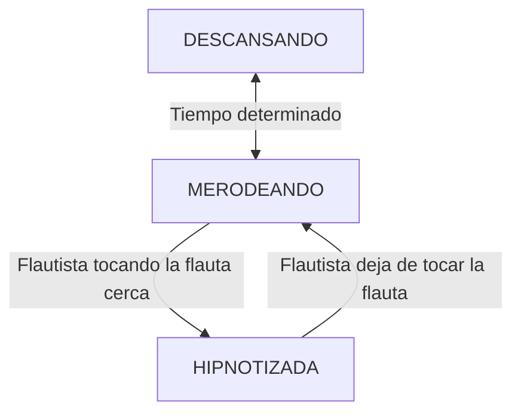
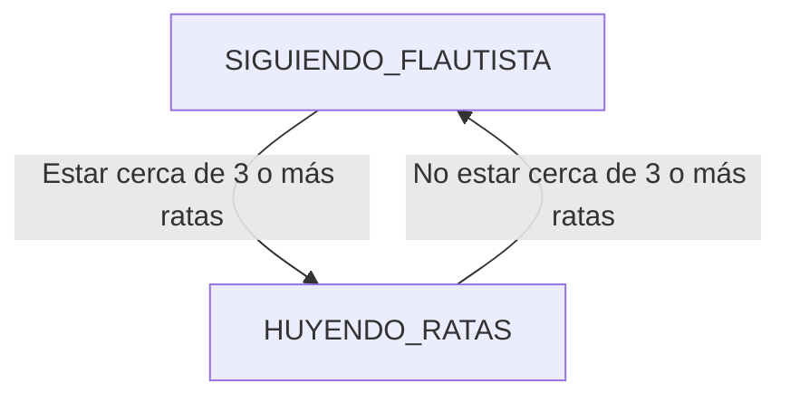
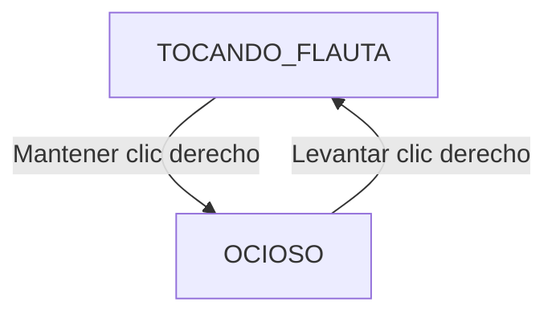

# Inteligencia Artificial para Videojuegos - Práctica 2: El Secreto del Laberinto

> [!NOTE]
> Versión: 1

<!-- > [!NOTE]
> Changelog: 
- [Instalación y uso](#instalación-y-uso)
    - Re-redactada sección y listada nueva build v1.
- [Diseño de la solución](#diseño-de-la-solución) 
    - Se ha añadido una explicación al pseudocódigo basada en la implementación del mismo en la práctica.
    - Se enlaza el código, documentado, al que referencia cada algoritmo.
    - Se completa y corrige la información que faltaba al no estar acabado el desarrollo de la práctica.
- [Implementación](#implementación)
    - Se ha completado la tabla de tareas.
    - Se completa y corrige la información que faltaba al no estar acabado el desarrollo de la práctica.
- [Pruebas y métricas](#pruebas-y-métricas)
    - Se ha reescrito el plan de pruebas, ordenando e indicando la característica que comprueban.
    - Se han añadido valores de métricas de FPS a raíz de varios tests en un mismo PC.
- [Ampliaciones](#ampliaciones)
    - Creada la sección.
    - Se han detallado las ampliaciones realizadas.
- [Conclusiones](#conclusiones)
    - Se ha reescrito el apartado, formulándose como una conclusión real.
- [Referencias](#referencias)
    - Se han buscado y usado referencias nuevas.
    - Se ha detallado de qué han servido las referencias nuevas y sus aportes. -->

## Índice
1. [Autores](#autores)
2. [Resumen](#resumen)
3. [Instalación y uso](#instalación-y-uso)
4. [Introducción](#introducción)
5. [Punto de partida](#punto-de-partida)
6. [Planteamiento del problema](#planteamiento-del-problema)
7. [Diseño de la solución](#diseño-de-la-solución)
8. [Implementación](#implementación)
9. [Pruebas y métricas](#pruebas-y-métricas)
10. [Ampliaciones](#ampliaciones)
11. [Conclusiones](#conclusiones)
12. [Licencia](#licencia)
13. [Referencias](#referencias)


## Autores
- Nieves Alonso Gilsanz [@nievesag](https://github.com/nievesag)
- Cynthia Tristán Álvarez [@cyntrist](https://github.com/cyntrist)

## Resumen
<!-- El proyecto consiste en un prototipo de videojuego que sirve de demostración técnica de algoritmos estándar de inteligencia artificial en NPCs en un entorno virtual 3D que representa el pueblo de Hamelín, un personaje controlable por el jugador que es el flautista de Hamelín y un perro compañero y un montón de ratas controlados con IA. -->

## Instalación y uso
Todo el contenido del proyecto está disponible en este repositorio, con **Unity 6000.0.66f2** o posterior siendo capaces de bajar todos los paquetes necesarios y editar el proyecto.

El release de la build más reciente estará disponible para descarga [aquí](https://github.com/IAV26-G09/IAV26-G09-P2/releases/latest).

## Introducción  
<!-- Este proyecto es una práctica de la asignatura de Inteligencia Artificial para Videojuegos del Grado en Desarrollo de Videojuegos de la UCM, cuyo enunciado original es este: [Plaga de Ratas](https://narratech.com/es/inteligencia-artificial-para-videojuegos/percepcion-y-movimiento/plaga-de-ratas/).

Se parte de la leyenda alemana del siglo XIII para plantear un escenario donde el jugador controla al flautista de Hamelin y todas las demás criaturas son controladas mediante IA: una de ellas es un **perro**, fiel compañero que seguirá al avatar del jugador a todas partes, aunque también hay **ratas** que merodean por todo el pueblo. El **flautista** puede tocar la flauta, y mientras lo hace, las ratas que le oigan comenzarán a seguirle. Estas pueden molestar al perro hasta el punto de hacerlo ladrar y huir, si tiene demasiadas ratas cerca.

Lo que se pretende con esta práctica es implementar **algoritmos de movimiento estándar** comúnmente utilizados en la industria del entretenimiento para dar vida a toda clase de seres que se mueven tanto en solitario como “en bandada”.

La versión original del prototipo proviene del repositorio de libro *Artificial Intelligence: A Modern Approach*, aunque el prototipo fue revisado y completado por Federico Peinado. El código se distribuye bajo la licencia LGPL. La versión actual y finalización del código a través del enunciado propuesto ha sido realizada por las autoras Nieves Alonso Gilsanz y Cynthia Tristán Álvarez. -->

Este proyecto está pensado para implementar el A* con una estructura de registro de nodo MUY SIMPLE (el identificador del nodo y el coste f) y ligada a los propios GameObjects que son baldosas del escenario. Sólo se plantea usar una lista de apertura (sin tener lista de cierre) y se asume que es posible tener la información completa del grafo (costes incluidos) en forma de una matriz en memoria.

Según el pseudocódigo que plantea Millington en su libro, la estructura de registro de nodo es más rica (identificador del nodo, conexión con el nodo padre, coste g y coste f), por supuesto se usa una lista de apertura y una lista de cierre, y en absoluto se asume que toda la información del grafo esté disponible desde el principio.

La cola de prioridad se puede implementar con PriorityQueue<TElement, TPriority>, estructura que se encuentra en el espacio de nombres System.Collections.Generic y fue introducida en .NET 6, siempre que el proyecto de Visual Studio esté configurado para ello. Si se usa un lenguaje C# antiguo, se podría usar una implementación de BinaryHeap como esta: https://github.com/NikolajLeischner/csharp-binary-heap.

## Punto de partida
<!-- Hemos partido de un proyecto base proporcionado por el profesor y disponible en este repositorio: [Hamelin - Base](https://github.com/narratech/hamelin-base)

La base consiste en el entorno del pueblo ya preparado para desarrollar la IA, con cada prefab de los tres tipos de agentes ya instanciados y componentes de agentes y de animaciones configurados pero sin el código de cada tipo de movimiento implementado. Cuenta con una interfaz básica meramente informativa con: 
- FPS
- Contador de ratas
- Controles:
    - Crear o destruir ratas (O / P).
    - Activar o desactivar obstáculos (T).
    - Cambiar cámara (N).
    - Cambiar ratio de FPS entre 30 y 60 (F).
    - Reiniciar juego (R).
También cuenta con movimiento del avatar del jugador con WASD y dos modos de cámara que siguen al jugador, aérea y en tercera persona. -->

## Planteamiento del problema
<!-- Esta práctica consiste en desarrollar el prototipo de un entorno virtual con obstáculos y un avatar controlado por el jugador, donde representamos el movimiento de un perro y una manada de ratas. El perro persigue al flautista con control de llegada. Cada rata, si el flautista no toca su flauta, merodea por el escenario, y si la toca y esta lo escucha, se dirige hacia él, en formación con las demás ratas y controlando la llegada, hasta quedar como "hipnotizadas” a su alrededor.

**El prototipo permitirá:**
* **A.** El punto de partida será el **mundo virtual con obstáculos Hamelín**, allí se ubican tanto el avatar del jugador como el agente que lo acompaña y la bandada de agentes que lo suele seguir. También permite cambiar entre tres cámaras: una general que está fija, otra que sigue al avatar en tercera persona y otra que sigue al acompañante.
* **B.** El **avatar** (flautista) es controlado por el jugador mediante el *ratón*. Si el *puntero* está más allá de *cierta distancia* del avatar, este camina en línea recta hacia la posición del puntero. Mientras se mantiene pulsado el *clic izquierdo*, el avatar corre más rápido, y si es el *clic derecho*, toca la flauta.
* **C.** El **acompañante** (perro) persigue continuamente al avatar del jugador con predicción (dinámica, especialmente marcada si el avatar corre) y control de llegada hasta quedarse a una cierta distancia del avatar. El acompañante encara en dirección a su propio movimiento y cuando detecta 3 o más agentes de la bandada a menos de *cierta distancia*, deja de perseguir al avatar para pasar a ladrar como loco mientras huye de la bandada hasta no tener *ningún* agente de la bandada a menos de *cierta distancia*.
* **D.** Mientras el avatar *no está* tocando la flauta, cada **agente individual de la bandada** (rata) merodea por todo el mundo virtual con obstáculos (con un movimiento errático y desordenado).
* **E.** Mientras el avatar *está* tocando la flauta, los agentes de la bandada (manada de ratas) encaran rápidamente al avatar y se produce su desplazamiento en bandada (hipnosis), con movimiento dinámico en formación (combinando *seguimiento*, fuerte *cohesión* y débil *separación*) y control de llegada hasta quedarse a *cierta distancia* del avatar. El prototipo está implementado de manera eficiente para *maximizar todo lo posible las métricas*, que en este caso son *el número* de agentes de la bandada que se pueden ubicar en el mundo virtual con obstáculos y seguir al avatar mientras se mantiene un ratio estable de 30 ó 60 fotogramas por segundo.

En cuanto a interfaz, hay un botón para reiniciar la simulación; Un campo de texto que permite introducir un número N y, pulsando un botón, ajustar el número exacto de agentes que hay en la bandada, creando o destruyendo todos los que hagan falta hasta alcanzar esa cifra. -->

## Diseño de la solución
<!-- El escenario del juego cuenta con un plano y unos obstáculos que representan el pueblo de Hamelin, sobre el que se moverán los agentes: el flautista (avatar del jugador), el perro (acompañante) y las ratas (agentes erráticos/bandada seguidora). 

En la interfaz destacan los controles previamente descritos en [Punto de Partida](#punto-de-partida), además de un **campo de entrada** con un **botón '*Ratear*'** con el que instanciar y destruir ratas en la parte inferior izquierda de la pantalla y un **botón '*Reiniciar*'** que reiniciará el juego situado en la esquina inferior derecha. 

El jugador se controla:
- Moviendo el ratón hacia la posición deseada y manteniendo el **clic izquierdo** para que vaya más rápido. 
- Manteniendo el **clic derecho** hará que toque la flauta.
- Con **N** podrá cambiar el tipo de cámara entre:
    - Cámara aérea fija sobre el pueblo.
    - Cámara en tercera persona sobre el avatar.
    - Cámara en tercera persona sobre el acompañante.

A continuación se detallan los estados de cada agente así como el pseudocódigo que se ha seguido para implementar a cada uno.  -->

La manera recomendada de realizar las pruebas está descrita en [Pruebas y Métricas](#pruebas-y-métricas)

### Estados de los agentes

<!-- - **Ratas**:


- **Perro**:


- **Flautista**:


Lo distintos algoritmos usados han sido para cada agente de IA:
* **Perro**: 
    * Seguimiento con llegada dentro
    * Persecución, que hereda de:
        * Seguimiento con llegada dentro
    * Huida
* **Ratas**: 
    * Merodeo
    * Seguimiento con llegada dentro
    * Separación -->

<!-- 
### Seguimiento con llegada dentro 
```
class Arrive:
    character: Kinematic
    target: Kinematic

    maxAcceleration: float
    maxSpeed: float

    # The radius for arriving at the target.
    targetRadius: float

    # The radius for beginning to slow down.
    slowRadius: float

    # The time over which to achieve target speed.
    timeToTarget: float = 0.1

    function getSteering() -> SteeringOutput:
        result = new SteeringOutput()

        # Get the direction to the target.
        direction = target.position - character.position
        distance = direction.length()

        # Check if we are there, return no steering.
        if distance < targetRadius:
            return null

        # If we are outside the slowRadius, then move at max speed.
        if distance > slowRadius:
            targetSpeed = maxSpeed
        # Otherwise calculate a scaled speed.
        else:
            targetSpeed = maxSpeed * distance / slowRadius

        # The target velocity combines speed and direction.
         targetVelocity = direction
        targetVelocity.normalize()
        targetVelocity *= targetSpeed

        # Acceleration tries to get to the target velocity.
        result.linear = targetVelocity - character.velocity
        result.linear /= timeToTarget

        # Check if the acceleration is too fast.
        if result.linear.length() > maxAcceleration:
            result.linear.normalize()
            result.linear *= maxAcceleration

        result.angular = 0
        return result
```
#### Explicación sobre su [*implementación*](https://github.com/IAV26-G09/IAV26-G09-P1/blob/main/Assets/Scripts/Comportamientos/Llegada.cs) en el proyecto:
Se calcula la dirección y distancia desde el agente hasta el objetivo, si se ha entrado en el radio objetivo el agente para, si aún no se ha llegado pero el agente se encuentra en el radio de realentizado se calcula la velocidad escalada en la que acercarse al objetivo y en caso contrario avanza a máxima velocidad en la dirección calculada.

### Huída
#### Explicación sobre su [*implementación*](https://github.com/IAV26-G09/IAV26-G09-P1/blob/main/Assets/Scripts/Comportamientos/Huir.cs) en el proyecto:
Se calcula el centroide entre las posiciones de las ratas colindantes a través de pesos en función de la distancia a cada rata. Ese centroide pasa a ser el objetivo del agente, se calcula la dirección en sentido contrario y se aplica una velocidad lineal en esa dirección con velocidad máxima.
Este comportamiento solo se activará cuando se detecten un número de ratas determinado a una distancia determinada del agente, esta comprobación se realiza en el script [*DogTriggerArea*](https://github.com/IAV26-G09/IAV26-G09-P1/blob/main/Assets/Scripts/Comportamientos/DogTriggerArea.cs) del objeto hijo del Perro *TriggerArea*. -->

<!-- ### Persecución
#### Pseudocódigo:
```
class Pursue extends Seek:
    # The maximum prediction time.
    maxPrediction: float

    # OVERRIDES the target data in seek (in other words this class has
    # two bits of data called target: Seek.target is the superclass
    # target which will be automatically calculated and shouldn't be set,
    # and Pursue.target is the target we're pursuing).
    target: Kinematic

    # ... Other data is derived from the superclass...

    function getSteering()-> SteeringOutput:
        # 1. Calculate the target to delegate to seek
        # Work out the distance to target.
        direction = target.position - character.position
        distance = direction.length()

        # Work out our current speed.
        speed = character.velocity.length()

        # Check if speed gives a reasonable prediction time.
        if speed <= distance / maxPrediction:
            prediction maxPrediction
        # Otherwise calculate the prediction time.
        else:
            prediction = distance / speed

        # Put the target together.
        Seek.target = explicitTarget
        Seek.target.position += target.velocity * prediction

        # 2. Delegate to seek.
        return Seek.getSteering()
``` -->
<!-- #### Explicación sobre su [*implementación*](https://github.com/IAV26-G09/IAV26-G09-P1/blob/main/Assets/Scripts/Comportamientos/Persecucion.cs) en el proyecto:
Se calcula la dirección y distancia desde el agente hasta el objetivo predicho, que será un GameObject vacío asignado en el inspector a Objetivo (del script *ComportamientoAgente*), distinto a objetivoReal (del script *Persecución*) al que se asignará el objetivo al que realmente quieres seguir, en este caso al Flautista.

Se calcula si la velocidad que necesitarías para recorrer la distancia ya mencionada en el tiempo maxPrediction dado es razonable teniendo en cuenta la velocidad que tenga el agente, si no lo es usas maxPrediction para calcular la posición predicha y si sí lo es se calcula el tiempo predicho que se tardaria en recorrer esa distancia.
Con este tiempo se calcula la posición predicha que perseguirá el perro en función de la posición del objetivo real, para conseguir simular una predicción.

### Merodeo
#### Pseudocódigo:
```
class Wander extends Face:
    # The radius and forward offset of the wander circle.
    wanderOffser: float
    wanderRadius: float

    # The maximum rate at which the wander orientation can change.
    wanderRate: float

    # The current orientation of the wander target.
    wanderOrientation: float

    # The maximum acceleration of the character.
    maxAcceleration: float

    # Again we don't need a new target.
    # ... Other data is derived from the superclass ...
    function getSteering() -> SteeringOutput:
        # 1. Calculate the target to delegate to face
        # Update the wander orientation.
        wanderOrientation += randomBinomial() * wanderRate

        # Calculate the combined target orientation.
        targetOrientation = wanderOrientation + character.orientation

        # Calculate the center of the wander circle.
        target = character.position + wanderOffset * character.orientation.asVector()

        # Calculate the target location.
        target += wanderRadius * targetOrientation.asVector()

        # 2. Delegate to face.
        result = Face.getSteering()

        # 3. Now set the linear acceleration to be at full accleleration in the direction of the orientation.
        result.linear = maxAcceleration * character.orientation.asVector()

        # Return it.
        return result
```
#### Explicación sobre su [*implementación*](https://github.com/IAV26-G09/IAV26-G09-P1/blob/main/Assets/Scripts/Comportamientos/Merodear.cs) en el proyecto:
El merodeo se divide en tres estados: *Idle*, *Nuevo Objetivo*, *Movimiento* con el objetivo de hacerlo más realista. Las ratas no buscan constantemente el siguiente objetivo si no que se paran a descansar un tiempo determinado antes de buscarlo. 
Cuando acaban de descansar empiezan a buscar el siguiente objetivo, para ello se calcula una dirección aleatoria hacia la que avanzará a continuación y en esa dirección se calcula la posición que tendrá el GameObject vacío que representa el objetivo al que quieres llegar. 
Una vez conoce su siguiente objetivo se empieza a mover hacia él a máxima velocidad, y no parará a volver a descansar hasta que se llegue al radio objetivo o se vuelva a cansar pasado un tiempo determinado.

### Separación
#### Pseudocódigo:
```
class Separation:
    character: Kinematic
    maxAcceleration: float

    # A list of potential targets.
    targets: Kinematic[]
    
    # The threshold to take action.
    threshold: float
    
    # The constant coefficient of decay for the inverse square law.
    decayCoefficient: float
    
    function getSteering() -> SteeringOutput:
        result = new SteeringOutput()
        
        # Loop through each target.
        for target in targets:
            # Check if the target is close.
            direction = target.position - character.position
            distance = direction.length()
            
            if distance > threshold:
                # Calculate the strength of repulsion (here using the inverse square law).
                strength = min(decayCoefficient / (distance * distance), maxAcceleration)
            
            # Add the acceleration.
            direction.normalize()
            result.linear += strength * direction
        
        return result
```
#### Explicación sobre su [*implementación*](https://github.com/IAV26-G09/IAV26-G09-P1/blob/main/Assets/Scripts/Comportamientos/Separacion.cs) en el proyecto:
Se recorren todos los agentes (obviándose al que esté ejecutando el script) y se calcula la distancia hasta estos, si el target está suficientemente cerca se aplica una fuerza de repulsión a la velocidad lineal usando la *Ley de la inversa del cuadrado*.

### Sobre los comportamientos coordinados
Tanto el agente Perro como los agentes Rata combinan varios comportamientos de dirección, para ello se utiliza una arquitectura híbrida usando mezcla, por pesos en el caso de las ratas y por prioridades en el caso del perro, y arbitraje, cediendo el control, en el momento de la huída del perro, y entre el merodeo y el seguimiento de las ratas.

Los valores de pesos y prioridades de cada comportamiento pueden asignarse en el inspector. Para los agentes Rata se han establecido los siguientes pesos, según el criterio del enunciado de la práctica: -->
| Comportamiento  |  Peso  |
|:-:|:-:|
| Separación | 1 |
| Merodeo | 2 |
| Llegada | 10 |

Para el agente Perro se han establecido las siguiente prioridades:
| Comportamiento  |  Prioridad  |
|:-:|:-:|
| Huir | 1 |
| Persecución | 2 |

## Implementación
**Tareas:**
Las tareas y el esfuerzo ha sido repartido de manera equitativa entre las autoras.

| Estado  |  Tarea  |  Fecha  |  
|:-:|:--|:-:|
<!-- | ✔ | Cámara fija | 29-1-2026 | -->
<!-- | ✔ | Cámara avatar (flautista) | 29-1-2026 |
| ✔ | Cámara acompañante (perro) | 29-1-2026 |
| ✔ | Campo de texto en interfaz y control de spawn/despawn de ratas básico | 3-2-2026 |
| ✔ | Control de spawn/despawn por corrutina | 5-2-2026 |
| ✔ | Botón de reinicio en interfaz | 8-2-2026 |
| ✔ | Seguimiento del agente acompañante (perro) | 8-2-2026 |
| ✔ | Merodeo de los agentes de la bandada (ratas) | 10-2-2026 |
| ✔ | Movimiento del avatar con input de ratón | 12-2-2026 |
| ✔ | Huida del agente acompañante (perro) | 12-2-2026 |
| ✔ | Hipnosis de los agentes de la bandada (ratas) | 17-2-2026 |
| ✔ | Separación de los agentes de la bandada (ratas) | 17-2-2026 |
| ✔ | Mejoras en la predicción de persecución | 17-2-2026 |
| ✔ | Separación de los agentes de la bandada (ratas) | 24-2-2026 |
| ✔ | Acceso a la velocidad real del agente desde *Agente* | 24-2-2026 |
|  | AMPLIACIONES |  |
| ✔ | Estado *Idle* de los agentes (ratas) durante el merodeo  | 24-2-2026 |
| ✔ | Cálculo del centroide en *Huida* por pesos según distancia al agente  | 25-2-2026 | -->

<!-- 
**Diagrama de clases:**
Las clases principales que se han desarrollados son las siguientes.

```mermaid
classDiagram
      SeguimientoCamara <|-- MonoBehaviour 
      TocarFlauta <|-- MonoBehaviour
      Agente <|-- MonoBehaviour
      ComportamientoAgente <|-- MonoBehaviour
      GestorJuego <|-- MonoBehaviour
      RatNumberInput <|-- MonoBehaviour
      ReiniciarButton <|-- MonoBehaviour
      DogTriggerArea <|-- MonoBehaviour

      class ComportamientoDireccion

      ControlJugador <|-- ComportamientoAgente
      ControlJugador <|-- ComportamientoDireccion : implements

      Huir <|-- ComportamientoAgente
      Huir <|-- ComportamientoDireccion : implements

      Llegada <|-- ComportamientoAgente
      Llegada <|-- ComportamientoDireccion : implements

      Persecucion <|-- Llegada

      Merodear <|-- ComportamientoAgente
      Merodear <|-- ComportamientoDireccion : implements

      Separacion <|-- ComportamientoAgente
      Separacion <|-- ComportamientoDireccion : implements
``` -->


<!-- **Implementación:**
Se adjuntan los *scripts* con el código fuente que implementan las principales características. Los *scripts* están documentados para mayor claridad y detalle sobre su implementación.

| Característica del prototipo | Descripción de la característica | Script |
|:-:|:-:|:-:|
| C | Huida del agente acompañante (perro) | [Huir](https://github.com/IAV26-G09/IAV26-G09-P1/blob/main/Assets/Scripts/Comportamientos/Huir.cs) |
| B | Movimiento del avatar con input de ratón y teclado | [ControlJugador](https://github.com/IAV26-G09/IAV26-G09-P1/blob/main/Assets/Scripts/Comportamientos/ControlJugador.cs) |
| C y E | Seguimiento del agente acompañante (perro) y bandada (ratas)| [Llegada](https://github.com/IAV26-G09/IAV26-G09-P1/blob/main/Assets/Scripts/Comportamientos/Llegada.cs) |
| C | Persecución con predicción del agente acompañante (perro) | [Persecucion](https://github.com/IAV26-G09/IAV26-G09-P1/blob/main/Assets/Scripts/Comportamientos/Persecucion.cs) |
| D | Merodeo de los agentes de la bandada (ratas) | [Merodear](https://github.com/IAV26-G09/IAV26-G09-P1/blob/main/Assets/Scripts/Comportamientos/Merodear.cs) |
| E | Hipnosis de los agentes de la bandada (ratas) | [Separacion](https://github.com/IAV26-G09/IAV26-G09-P1/blob/main/Assets/Scripts/Comportamientos/Separacion.cs) |
| B y E | Hipnosis de los agentes de la bandada (ratas) | [TocarFlauta](https://github.com/IAV26-G09/IAV26-G09-P1/blob/main/Assets/Scripts/Comportamientos/TocarFlauta.cs) |
| General | Gestión de comportamientos asociados a los agentes | [Agente](https://github.com/IAV26-G09/IAV26-G09-P1/blob/main/Assets/Scripts/Agente.cs) |
| General | Plantilla para los comportamientos de los agentes | [ComportamientoAgente](https://github.com/IAV26-G09/IAV26-G09-P1/blob/main/Assets/Scripts/ComportamientoAgente.cs) |
| General | Clase auxiliar para representar el comportamiento de dirección | [ComportamientoDireccion](https://github.com/IAV26-G09/IAV26-G09-P1/blob/main/Assets/Scripts/ComportamientoDireccion.cs) |
| A | GameManager (gestiona estados, entidades y cámaras) | [GestorJuego](https://github.com/IAV26-G09/IAV26-G09-P1/blob/main/Assets/Scripts/GestorJuego.cs) |
| A | Control de spawn/despawn por corrutina | [RatNumberInput](https://github.com/IAV26-G09/IAV26-G09-P1/blob/main/Assets/Scripts/RatNumberInput.cs) |
| A | Botón de reinicio en interfaz | [ReiniciarButton](https://github.com/IAV26-G09/IAV26-G09-P1/blob/main/Assets/Scripts/ReiniciarButton.cs) |
| C | Control de agentes en el area de trigger del agente perro | [DogTriggerArea](https://github.com/IAV26-G09/IAV26-G09-P1/blob/main/Assets/Scripts/Comportamientos/DogTriggerArea.cs) | -->

## Pruebas y métricas

### Plan de pruebas
Serie corta y rápida posible de pruebas que pueden realizarse para verificar que se cumplen las características requeridas:

* **1. (A).** 
* **1. (B).** 
* **1. (C).** 
* **1. (D).**
* **1. (E).** 

### Métricas tomadas
En un PC de estas características:
- **CPU:** Intel Core i5-12600KF a 3.70 GHz
- **GPU:** NVIDIA GeForce RTX 5070 Ti con 16 GB
- **RAM:** 32 GB (16x2) de 4800 MT/s
- **SO:** Windows 11
- **Versión de Unity:** 6000.0.66f2

<!-- Se han tomado las siguientes métricas:

- En vista aérea, sin colisión entre ratas y sin hipnotizar deja de haber 60 FPS estables al pasar las 1300 ratas y se queda en una mediana de 59 fps.
- Al llegar a 1500, la media es de 56 fps.
- En 1750, de 47 fps.
- En 2000, de 38 fps.
- Una vez se pasa de 2250 se baja de 30 fps.
- En 2500, de 25 fps.
- En 3000, de 17 fps.
- En 4000, de 3 fps.

- En vista aérea, sin colisión entre ratas y e hipnotizándolas deja de haber 60 FPS estables al pasar las 250 ratas empieza a caer considerablemente.
- Al llegar a 300, la media es de 45 fps.
- Al llegar a 400, la media es de 30 fps.
- Al llegar a 500, la media es de 19 fps.
- Al llegar a 600, la media es de 13 fps.
- Al llegar a 700, la media es de 9 fps.
- Al llegar a 800, la media es de 7 fps.
- Al llegar a 900, la media es de 6 fps.
- Al llegar a 1000, la media es de 5 fps.
  
En el siguiente gráfico, la línea azul representa la métrica de ratas sin hipnotizar y la línea verde la de ratas hipnotizadas. -->

```mermaid
xychart-beta
title "Ratas-FPS"
x-axis "Ratas" [0, 1]
y-axis "FPS" 0 --> 60
line [0, 1]
line [0, 1]
```


### Vídeo

<!-- - [Vídeo demostración](https://youtu.be/HxN5z2ei1y8) -->

## Ampliaciones
<!-- Se han desarrollado dos ampliaciones, ambas detalladas en el apartado de [*Diseño de la solución*](#diseño-de-la-solución): 
1. Una relacionada con el [*Merodeo*](#explicación-sobre-su-implementación-en-el-proyecto-3), esta se basa en que las ratas tengan un momento estático entre movimiento y movimento a modo de "descanso", logrando así un comportamiento más realista.
2. Otra relacionada con la [*Huida*](#explicación-sobre-su-implementación-en-el-proyecto-3), pesando las distancias a las ratas para calcular un centroide más preciso y hacer que el agente que huye huya más fuerte de la más cercana. -->

## Conclusiones
<!-- El desarrollo de esta práctica ha permitido asentar las bases de algoritmos clásicos de movimiento y sirve de  primer acercamiento a la inteligencia artificial orientada a videojuegos en agentes como individuos y como grupos. 

De igual manera ha servido como comprobación de que algoritmos relativamente simples dan lugar a resultados creíbles e interesantes, especialmente cuando combinados adecuadamente dentro de un entorno con cierto grado de interactividad.

Queda recalcada la importancia de la modularidad de los comportamientos según el estado del agente, combinándose entre sí con distintos tipos de sistemas que los gestionen, y la importancia de la escalabilidad de los algoritmos por agente de cara a la optimización y el rendimiento en hardware. -->

## Licencia
Nieves Alonso Gilsanz y Cynthia Tristán Álvarez, con el permiso de Federico Peinado, autores de la documentación, código y recursos de este trabajo, concedemos permiso permanente para utilizar este material, con sus comentarios y evaluaciones, con fines educativos o de investigación; ya sea para obtener datos agregados de forma anónima como para utilizarlo total o parcialmente reconociendo expresamente nuestra autoría. 

## Referencias
<!-- A continuación se detallan todas las referencias bibliográficas, lúdicas o de otro tipo utilizdas para realizar este prototipo. Los recursos de terceros que se han utilizados son de uso público[^1][^2][^3].

El diseño e implementación de los algoritmos aquí desarrollados se ha apoyado principalmente en *Millington*[^4], referenciado ampliamente a lo largo del contenido del curso en Narratech[^5][^6][^7][^8], que ha proporcionado la base teórica para los comportamientos de *Llegada*, *Persecución*, *Huida*, *Merodeo* y *Separación*, además de los mecanismos de combinación por peso o prioridades.

Los artículos de *Reynolds*[^9][^10] son la base histórica y clásica del comportamiento de agentes en grupo implementados en *Separación*. Las aportaciones de *Shiffman*[^11] y *Yannakakis y Togelius*[^12] sirven de referencia complementaria para entender los sistemas de agentes autónomos con visión más actualizada y contemporánea. -->

<!-- [^1]: Lousberg, K. (s. f.). [*Kaykit animations*](https://kaylousberg.itch.io/kaykit-animations)

[^2]: Lousberg, K. (s. f.). [*Kaykit dungeon*](https://kaylousberg.itch.io/kaykit-dungeon)

[^3]: Lousberg, K. (s. f.). [*Kaykit medieval builder pack*](https://kaylousberg.itch.io/kaykit-medieval-builder-pack)

[^4]: Millington, I. (2019). *AI for games* (3rd ed.). CRC Press.

[^5]: Narratech [*Plaga de Ratas*](https://narratech.com/es/inteligencia-artificial-para-videojuegos/percepcion-y-movimiento/plaga-de-ratas/)

[^6]: Narratech [*Física y animación*](https://narratech.com/es/inteligencia-artificial-para-videojuegos/percepcion-y-movimiento/fisica-y-animacion/)

[^7]: Narratech [*Comportamiento de dirección*](https://narratech.com/es/inteligencia-artificial-para-videojuegos/percepcion-y-movimiento/comportamiento-de-direccion/)

[^8]: Narratech [*Desplazamiento en grupo*](https://narratech.com/es/inteligencia-artificial-para-videojuegos/percepcion-y-movimiento/desplazamiento-en-grupo/)

[^9]: Reynolds, C. (1995). [*Boids*](https://www.red3d.com/cwr/boids/).

[^10]: Reynolds, C. (1999). [*Steering Behaviors For Autonomous Characters*](https://www.red3d.com/cwr/steer/gdc99/)

[^11]: Shiffman, D. (2024). *Autonomous Agents*. [Nature of Code](https://natureofcode.com/).
 
[^12]: Yannakakis, G., Togelius, J. (2025). *Artificial Inteligence and Games*. (2nd ed.) Springer. -->

[^1]: [Kaykit Medieval Builder Pack](https://kaylousberg.itch.io/kaykit-medieval-builder-pack)

[^1]: [Kaykit Dungeon](https://kaylousberg.itch.io/kaykit-dungeon)

[^1]: [Kaykit Animations](https://kaylousberg.itch.io/kaykit-animations)

[^1]: *AI for Games*, Ian Millington.

[^1]: Aversa, D. (2022). *Unity Artificial Intelligence Programming*. (Fifth Edition.) Packt.

[^1]: [*Unity Artificial Intelligence Programming* Repository](https://github.com/PacktPublishing/Unity-Artificial-Intelligence-Programming-Fifth-Editionhttps://github.com/PacktPublishing/Unity-Artificial-Intelligence-Programming-Fifth-Edition). (Fifth Edition.) Packt.
